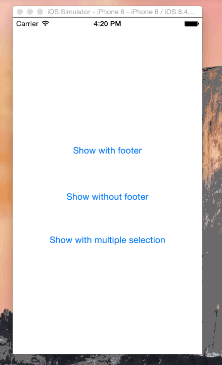

# CZPicker

[](https://travis-ci.org/chenzeyu/CZPicker)
[](http://cocoapods.org/pods/CZPicker)
[](http://cocoapods.org/pods/CZPicker)
[](http://cocoapods.org/pods/CZPicker)

## Demo


## Change Log
3 most recent changes are listed here.

Full [change logs](CHANGELOG.md)

### v0.4.2 - 2016-04-12
- Improve orientation handler to avoid unnecessary pop up animations.

### v0.4.1 - 2016-04-10
- Remove bundle resources setting in podspec file.

### v0.4.0 - 2016-04-09
- Added ```pickerWidth``` for setting picker width.

## Usage

CZPicker is available through [CocoaPods](http://cocoapods.org). To install
it, simply add the following line to your Podfile:

```ruby
pod "CZPicker"
```

To run the example project, clone the repo, and run `pod install` from the Example directory first.

If you are using swift, please refer to [CZPicker Swift Demo](https://gist.github.com/chenzeyu/6d19a343ffc8d6530fd0)

To show the picker, simply adding the following code:

```objective-c
CZPickerView *picker = [[CZPickerView alloc] initWithHeaderTitle:@"Fruits"
                        cancelButtonTitle:@"Cancel"
                        confirmButtonTitle:@"Confirm"];
picker.delegate = self;
picker.dataSource = self;
[picker show];
```
and implement the dataSource and Delegate methods:

```objective-c
#prama mark - CZPickerViewDataSource

@required
/* number of items for picker */
- (NSInteger)numberOfRowsInPickerView:(CZPickerView *)pickerView;

@optional
/*
 Implement at least one of the following method,
 czpickerView:(CZPickerView *)pickerView
 attributedTitleForRow:(NSInteger)row has higer priority
*/

/* attributed picker item title for each row */
- (NSAttributedString *)czpickerView:(CZPickerView *)pickerView
                            attributedTitleForRow:(NSInteger)row;

/* picker item title for each row */
- (NSString *)czpickerView:(CZPickerView *)pickerView
                            titleForRow:(NSInteger)row;


#prama mark - CZPickerViewDelegate
@optional
/** delegate method for picking one item */
- (void)czpickerView:(CZPickerView *)pickerView
          didConfirmWithItemAtRow:(NSInteger)row;

/** delegate method for picking multiple items,
 implement this method if allowMultipleSelection is YES,
 rows is an array of NSNumbers
 */
- (void)czpickerView:(CZPickerView *)pickerView
          didConfirmWithItemsAtRows:(NSArray *)rows;
/** delegate method for canceling */
- (void)czpickerViewDidClickCancelButton:(CZPickerView *)pickerView;
```

## Customization
There are a lot of things can be customized, change the following properties to customize the picker of your own:

```objective-c
/** whether to show footer (including confirm and cancel buttons), default NO */
@property BOOL needFooterView;

/** whether allow tap background to dismiss the picker, default YES */
@property BOOL tapBackgroundToDismiss;

/** whether allow selection of multiple items/rows, default NO, if this
 property is YES, then footerView will be shown */
@property BOOL allowMultipleSelection;

/** picker header background color */
@property (nonatomic, strong) UIColor *headerBackgroundColor;

/** picker header title color */
@property (nonatomic, strong) UIColor *headerTitleColor;

/** picker cancel button background color */
@property (nonatomic, strong) UIColor *cancelButtonBackgroundColor;

/** picker cancel button normal state color */
@property (nonatomic, strong) UIColor *cancelButtonNormalColor;

/** picker cancel button highlighted state color */
@property (nonatomic, strong) UIColor *cancelButtonHighlightedColor;

/** picker confirm button background color */
@property (nonatomic, strong) UIColor *confirmButtonBackgroundColor;

/** picker confirm button normal state color */
@property (nonatomic, strong) UIColor *confirmButtonNormalColor;

/** picker confirm button highlighted state color */
@property (nonatomic, strong) UIColor *confirmButtonHighlightedColor;

/** picker's animation duration for showing and dismissing*/
@property CGFloat animationDuration;

```


## Author

chenzeyu, zeyufly@gmail.com

## License

CZPicker is available under the MIT license. See the LICENSE file for more info.

## Credits

CZPicker is created at and supported by [Fooyo.sg](http://fooyo.sg)
